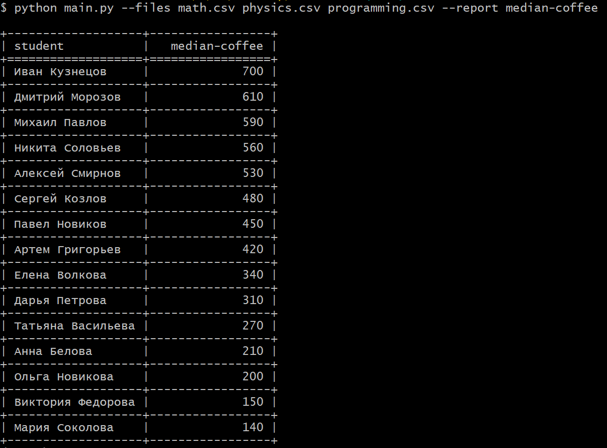
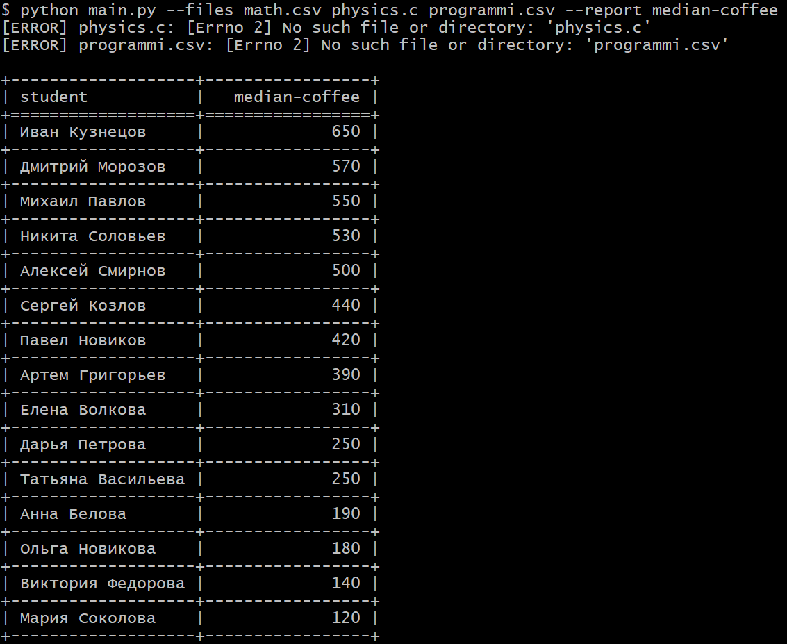
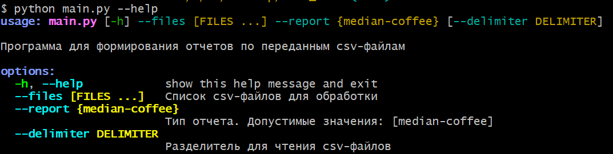

# CSV Report Generator

## О проекте

Приложение предназначено для формирования различных отчётов на основе данных из CSV файлов.

**Как пользоваться:**

Для генерации отчета нужно вызвать команду:
- python main.py --files <пути_к_csv_файлам_через_пробел> --report <тип_отчёта> [--delimiter <разделитель>]

    < --files > обязательный параметр, список путей к csv файлам.

    < --report > обязательный параметр, название требуемого отчета.

    < --delimiter > необязательный параметр, разделитель для чтения csv файлов (по умолчанию ",")

Для получение справки:
- python main.py --help

**Демонстрация**

- median-coffee отчет, когда все введено корректно:

- median-coffee отчет, когда несколько путей к файлам введены некорректно (отображение ошибки в консоли и некорректно введенного пути). Отчет формируется по файлам с корректно введенными путями

- справка при вызове команды --help

**Текущие отчёты:**
- `median-coffee` — расчёт медианных трат на кофе для каждого студента

**Добавление новых отчетов:**

- Для добавления нового отчета нужно создать новый класс (унаследованный от BaseReport)
и зарегистрировать его ReportFactory.register_report(<название_отчета>, BaseReport)

## Тесты

Pytest: 98% покрытие тестами.

Запустить тесты можно командой: pytest.

Конфигурация тестирования в файле pytest.ini

## Архитектура

- **BaseReport** — абстрактный базовый класс, задающий интерфейс для всех отчётов
- **ReportFactory** — фабрика, управляющая регистрацией и созданием отчётов
- **CSVReader** — класс для чтения и объединения данных из CSV файлов
- **ArgsParser** — обработка аргументов командной строки
